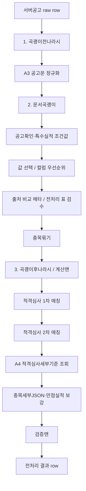

# 작업 흐름

## 전체 흐름

```text
수집 -> 전처리 -> 사람입력 -> 최종출력
                  ^
                룰관리
```

## 1. 수집

수집은 `서버공고(A1)`에서 모든 공고 컬럼 자료를 받는 단계다.
다른 발주처 홈페이지나 공고문 파싱 결과를 수집 원본으로 섞지 않는다.

예시:

```text
서버공고 API에서 공고번호, 공사명, 발주처, 기초금액, 추정가격, 종목, 지역제한 등
서버가 내려주는 모든 컬럼을 한 행으로 받는다.
`적격발주처` 컬럼이 있더라도 값이 항상 채워진다고 보지 않는다.
```

주의:

```text
A3 파싱용공고문, A2 공고문첨부파일, A4 적격심사세부기준은 수집 원본이 아니다.
전처리 중 빈값 보완, 기준 조회, 사람 확인을 위해 참조하는 보조 API다.
```

## 2. 전처리

전처리는 서버공고 raw row를 최종 분류 가능한 표준 row로 만드는 단계다.
전처리 전체 파이프라인을 `곡괭이질`이라고 부른다.

곡괭이질은 아래 흐름으로 나눈다. 큰 줄기는 `곡괭이전나라시 -> 문서곡괭이 -> 곡괭이후나라시`이지만,
문서곡괭이가 안정적으로 값을 뽑기 위해 A3 공고문 정규화와 조건값 채우기를 별도 구현 단위로 관리한다.

```text
1. 곡괭이전나라시
2. 문서곡괭이
3. 곡괭이후나라시
```



### 2-1. 곡괭이전나라시

`곡괭이전나라시`는 서버공고 raw 데이터만 보고 먼저 정리할 수 있는 전처리다.
문서곡괭이가 공고문을 읽기 전에 실행한다.

역할:

| 기능 | 설명 | 예시 |
|---|---|---|
| 공고명 삭제기준 | 삭제키워드 룰로 전처리 대상 제외 | `공사명`에 `[취]` 포함 시 제외 |
| 괄호정리 | 공사명 등에서 룰에 맞는 괄호 표현 정리 | `공사명(긴급)` 처리 |
| 적격발주처변경 | 발주처/적격발주처 문자열을 기준으로 원발주처 후보 생성 | `한국남부발전 -> 조달청` |
| 투찰금액산식 | 서버공고 raw 금액으로 가능한 산식 선처리 | 산식 대상 컬럼 사전 계산 |
| 기타 raw 정리 | 파싱 없이 확실한 값만 정리 | 날짜 형식, 숫자 형식 정규화 |

예시:

```text
서버공고 공사명=[취] 도로정비공사
rules_deleteKeywords: scope=공사명, keyword=[취]
  -> 전처리 대상에서 제외
```

예시:

```text
서버공고 발주처=한국남부발전
발주처/적격발주처 변경 룰=한국남부발전 -> 조달청
  -> 원발주처 후보=조달청
  -> 적격발주처가 빈값이면 이 단계에서 억지로 채우지 않음
```

### 2-2. 문서곡괭이

`문서곡괭이`는 A3 파싱용공고문 HTML을 읽고 서버공고의 빈값이나 검증이 필요한 값을 보완한다.
먼저 공고문을 원문줄, 문단, 번호/섹션, 표 후보로 정규화한 뒤 조건판단형태와 검색키워드 룰을 적용한다.

역할:

```text
HTML 공고문 -> 원문줄/문단/번호섹션/표 후보 정규화 -> 조건판단형태 룰 실행 -> 컬럼 후보와 근거 추출
```

예시:

```text
본문=전기공사업 등록업체
문서곡괭이 결과:
종목 후보=전기
source_text=전기공사업 등록업체
```

예시:

```text
본문=본 공고는 전자시담 방식으로 진행합니다.
공고확인 설정 결과값=전자시담
검색키워드=전자시담
  -> 공고확인 후보=전자시담
```

### 2-3. 값 선택

서버공고 값, 문서곡괭이 값, 계산 후보가 같은 컬럼을 채울 수 있다.
최종 후보 선택은 컬럼룰의 우선순위를 따른다.

예시:

```text
입찰방식 컬럼 우선순위=문서곡괭이
서버공고 입찰방식=제한경쟁
문서곡괭이 입찰방식=적격심사
  -> 최종 후보 입찰방식=적격심사
```

값 선택 직후 전처리 표에는 출처 비교 메타를 남긴다.
이 메타는 작업자가 노랑 셀만 우선 확인할 수 있게 하기 위한 검수 보조 정보다.

규칙:

| 서버공고 | 문서곡괭이 | 표시 | 의미 |
|---|---|---|---|
| 값 있음 | 같은 값 | 녹색 | 두 출처가 일치하므로 신뢰 가능 |
| 값 있음 | 다른 값 | 노랑 | 출처 충돌, 사람 검토 필요 |
| 값 있음 | 없음 | 노랑 | 서버공고만 채움 |
| 없음 | 값 있음 | 노랑 | 문서곡괭이만 채움 |
| 없음 | 없음 | 무색 | 비교할 값 없음 |

예시:

```text
서버공고 추정가격=1,200,000,000
문서곡괭이 추정가격=1,200,000,000
  -> 전처리 표 추정가격 셀 녹색

서버공고 종목=건축
문서곡괭이 종목=건축/토목
  -> 전처리 표 종목 셀 노랑, 툴팁에서 서버공고/문서곡괭이/근거 확인
```

구현 메모:

```text
출처 비교 메타는 숨김 컬럼 `출처비교JSON`에 저장한다.
화면 표시 컬럼을 두 배로 늘리지 않는다.
전처리 표에서만 색상과 툴팁으로 보여준다.
```

### 2-4. 곡괭이후나라시

`곡괭이후나라시`는 계산맨이다.
문서곡괭이와 값 선택 이후, 다른 컬럼을 참조해서 계산 컬럼을 채운다.

역할:

```text
다른 컬럼 참조 계산
마스터 lookup
조건식 처리
RuleNode 평가
```

예시:

```text
발주처=한국전력공사
발주처코드 마스터 lookup
  -> 발주처코드=A001
```

예시:

```text
기초금액=1,000,000,000
A값=300,000,000
투찰율=0.97
  -> 투찰율_투찰금액=(기초금액-A값)*투찰율+A값
```

## 3. 적격심사기준을 찾기 위한 전처리 순서

아래 순서는 `곡괭이질` 안에서 적격심사기준을 찾는 데 필요한 세부 흐름이다.

```text
1. 서버공고에서 모든 컬럼을 받는다.
2. 곡괭이전나라시로 서버공고 raw 값만 보고 가능한 정리를 먼저 한다.
3. A3 파싱용공고문을 원문줄, 문단, 번호/섹션, 표 후보로 정규화한다.
4. 정규화 결과를 문서곡괭이로 읽어 빈값과 조건값 후보를 보완한다.
5. 공고확인, 특수실적, 특수실적_공통 같은 조건값을 문서곡괭이 또는 사람입력으로 채운다.
6. 컬럼룰의 우선순위로 서버공고/문서곡괭이/계산 후보 중 최종 후보를 고른다.
7. 서버공고와 문서곡괭이 후보를 비교해 전처리 표의 색상/툴팁 검수 메타를 만든다.
8. 종목묶기로 `종목`, `단독평가종목`, `종목세부JSON` 기초값을 만든다.
9. 곡괭이후나라시가 다른 컬럼을 참조해 계산 컬럼을 채운다.
10. 입찰방식이 적격심사 제외 대상이면 `적격평가기준_세부`를 빈값으로 둔다.
11. 1차 매칭으로 `원발주처`, 주공종 건설유형, 추정가격, 공고일/입력일을 기준으로 기본 `적격평가기준_세부`를 찾는다.
12. 2차 매칭으로 `공고확인`, `특수실적` 같은 세부 조건을 확인하고 필요하면 `원발주처`, `적격평가기준_세부`를 덮어쓴다.
13. A4 적격심사세부기준 API에서 기준 row를 불러온다.
14. 기준 row의 실적배수와 인정기간으로 종목세부JSON과 계산 컬럼을 보강한다.
15. 필요하면 사람이 빈값과 애매한 값을 입력한다.
16. 사람 입력 후 필요한 컬럼만 재전처리한다.
```

예시:

```text
서버공고 발주처=한국전력공사
문서곡괭이 공고확인=배전공가

1차 매칭:
한국전력공사_3억미만

2차 매칭:
공고확인=배전공가 조건이 맞음
  -> 원발주처=한국전력공사(배전공가)
  -> 적격평가기준_세부=한국전력공사(배전공가)_3억미만
```

## 4. 사람입력

빈값, 충돌값, 애매한 값만 사람이 확인하고 입력한다.
사람이 입력한 값은 문서곡괭이가나 계산맨이 다시 덮지 않는다.

예시:

| 상황 | 처리 |
|---|---|
| 서버공고 종목은 `기타`, 공고문에는 `전기공사업` | 사람 확인 후 최종값 선택 |
| 지역제한이 비어 있음 | 공고문 후보를 보고 사람 입력 |
| 공고확인 자동값이 틀림 | 사람이 직접 수정 후 2차 매핑 재실행 |

## 5. 최종출력

검증 기준을 통과한 데이터를 엑셀 파일로 출력한다.
최종 엑셀은 서버공고에서 받은 모든 표준 컬럼을 포함한다.

예시:

```text
2026-05-22_입찰공고_최종분류.xlsx
```

## 룰관리

룰관리는 흐름 중간에 끼는 작업 단계가 아니라 전체 흐름에서 사용하는 기준표다.

관리 대상:

| 대상 | 예시 |
|---|---|
| 곡괭이전나라시 룰 | 삭제키워드, 괄호정리, 적격발주처변경, raw 날짜/숫자 정리 |
| 문서곡괭이 룰 | 공고문 정규화, 섹션설정, 조건판단형태, 검색키워드, 제외키워드 |
| 곡괭이후나라시 룰 | RuleNode, lookup, expr, cond |
| 값 선택 우선순위 | 사람 입력값 > 코드 규칙값 > 문서곡괭이 추출값 > 서버공고값 |
| 재전처리 의존관계 | `공고확인` 변경 시 2차 매핑 재실행 |
| 종목 묶기 | `건축/토목 -> (건축,토목)/토건` |


