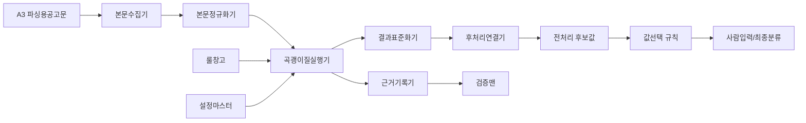

# 파서맨 새 구조 설계 초안

작성일: 2026-05-24

## 목적

파서맨은 파싱용공고문에서 필요한 값을 결정형으로 추출하는 룰 엔진이다.
기존 참고자료의 흐름과 매처 개념은 참고하되, 코드 구조와 파일명은 그대로 복사하지 않는다.

이유:

```text
기존 구현은 기능을 하나씩 추가하면서 중복과 예외가 쌓였다.
새 구조에서는 설정 데이터, 매처, 후처리, 검증을 분리해 유지보수를 쉽게 만든다.
```

예시:

```text
공고문에 "전자시담"이 있으면
파서맨은 공고확인 설정에서 `전자시담` 룰을 찾아
공고확인=전자시담 후보와 원문 근거를 기록한다.
```

## 2026-05-26 추가 참고자료 반영

기존 `곡괭이질 버튼` 문서는 예전 구현의 전체 흐름을 보여주는 참고자료다.
새 구조에서는 그 흐름을 한 함수나 한 화면에 그대로 몰아넣지 않고, 역할별 모듈로 분리한다.

가져갈 것:

```text
대상 row 필터
삭제키워드 필터
실패 row 보존
한 건씩 진행 UI 갱신
파서 근거 기록
계산맨 실행
검증 상태 기록
미등록 발주처 모음 알림
```

버릴 것:

```text
Raw 화면 함수가 전체 파이프라인을 직접 제어하는 구조
mapAiToNotice 같은 한 함수에 종목/지역/보험료/금액 특수분기가 몰리는 구조
파서 결과, 계산 결과, 검증 결과가 한 patch에 뒤섞이는 구조
native alert 중심의 작업 완료/오류 안내
```

예시:

```text
예전 흐름:
Raw 화면의 전처리 버튼 함수가 fetch, parse, map, calculate, validate, classify, match를 모두 직접 호출

새 구조:
전처리실행기 -> 곡괭이전나라시 -> 본문수집기 -> 파서맨 -> 컬럼값선택기 -> 종목묶기 -> 곡괭이후나라시 -> 적격매칭 -> 검증맨
```

## 전체 구조



## 구성 요소

| 이름 | 역할 | 예시 |
|---|---|---|
| 본문수집기 | A3 파싱용공고문 HTML만 사용한다. A2 첨부파일 fallback은 구현하지 않는다 | `bidHwp_get` HTML |
| 본문정규화기 | HTML을 텍스트, 문단, 표, 위치 정보로 나눈다 | `<p>추정가격...</p>` -> 블록 |
| 룰창고 | 파서 룰을 저장하고 설정 화면에서 수정한다 | `대상컬럼=입찰방식`, `조건판단형태=3_2` |
| 설정마스터 | 종목, 지역, 공고확인, 특수실적, 특수실적_공통 같은 운영 데이터를 제공한다 | `공고확인 결과값=전자시담` |
| 곡괭이질실행기 | 룰과 본문을 결합해 후보값을 만든다 | `검색키워드=전자시담` 매칭 |
| 결과표준화기 | 매처마다 다른 결과를 같은 형태로 바꾼다 | `{컬럼, 값, rule_id, source_text}` |
| 후처리연결기 | 종목/지역/실적 같은 값을 마스터 기준으로 전처리한다 | `구리` -> `경기,구리시` |
| 근거기록기 | 선택 이유와 원문 근거를 남긴다 | `matched_keyword=전자시담` |
| 검증맨 | 샘플 공고로 룰 결과를 테스트하고 오류 후보를 보여준다 | 기대값과 실제값 비교 |
| 회귀가드 | 기존 성공 케이스가 깨지는지 확인한다 | `R26...` 샘플 재실행 |

## 입력과 출력

입력:

```text
공고 row
파싱용공고문 HTML
설정마스터
파서 룰
```

출력:

```text
컬럼별 후보값
후보별 출처
후보별 원문 근거
후보별 상태
후처리 필요 여부
```

표준 후보 형태:

```json
{
  "column": "공고확인",
  "value": "전자시담",
  "source": "parserman",
  "setting_table": "공고확인",
  "rule_id": 40,
  "matched_keyword": "전자시담",
  "source_text": "본 공고는 전자시담 방식으로 진행합니다.",
  "status": "확정후보"
}
```

## 설정 데이터 연결

파서맨은 설정 데이터를 합치지 않고 각각 따로 읽는다.

```text
공고확인 설정        -> 공고확인 후보
특수실적 설정        -> 특수실적 후보
특수실적_공통 설정   -> 특수실적_공통 후보
지역설정             -> 지역제한/공사현장 후보
종목매핑             -> 종목/주력분야 후보
```

예시:

```text
본문="본 공고는 전자시담으로 진행합니다."
공고확인 설정 결과값=전자시담, 검색키워드=전자시담
  -> 공고확인=전자시담

본문="사회적기업 확인서를 보유한 업체"
특수실적_공통 설정 결과값=사회적기업, 검색키워드=사회적기업
  -> 특수실적_공통=사회적기업
```

## 룰 구조

파서 룰은 컬럼을 채우는 방법을 설명한다.
운영자가 설정 화면에서 수정할 수 있어야 한다.

권장 필드:

| 필드 | 의미 | 예시 |
|---|---|---|
| id | 룰 식별값 | `101` |
| 사용여부 | 임시 비활성화 | `true` |
| 대상컬럼 | 채울 컬럼 | `입찰방식` |
| 조건판단형태 | 매처 타입 | `3_2` |
| 검색키워드 | 찾을 문구. 줄바꿈 다중 입력 | `전자시담` |
| 제외키워드 | 매칭 제외 문구 | `해당없음` |
| 고정값 | 매칭 시 반환값 | `1`, `전자시담` |
| 참조마스터 | 종목/지역/공고확인 같은 설정 데이터 | `공고확인` |
| 문맥범위 | 키워드 주변 몇 글자를 볼지 | `200` |
| gap | 와일드카드 허용 글자 수 | `15` |
| 우선순위 | 여러 룰이 맞을 때 순서 | `10` |
| 후처리 | 결과 정규화 방식 | `지역정규화`, `종목정규화` |
| 예시본문 | 테스트용 본문 | `본 공사는 전자시담입니다.` |
| 기대값 | 예시본문에서 나와야 할 값 | `전자시담` |
| 설명 | 사람이 읽는 룰 설명 | `전자시담 방식 확인` |

예시:

```text
대상컬럼=공고확인
조건판단형태=3_1
검색키워드=전자시담
고정값=전자시담
참조마스터=공고확인
예시본문=본 공고는 전자시담 방식으로 진행합니다.
기대값=전자시담
```

## 조건판단형태 카탈로그

기존 참고자료의 14개 타입은 첫 버전 카탈로그로 유지한다.
단, 구현은 새 구조에서 다시 만든다.

| 타입 | 이름 | 용도 | 예시 |
|---|---|---|---|
| 1_1 | 날짜 | 키워드 뒤 날짜 추출 | `개찰일시: 2026.05.10` -> `2026-05-10` |
| 1_2 | 금액 | 키워드 뒤 금액 추출 | `추정가격: 1,234,000원` -> `1234000` |
| 1_3 | 전화번호 | 키워드 뒤 전화번호 추출 | `담당자 02-123-4567` |
| 1_4 | 비율/분수 | `%`, `100분의 49` 추출 | `49%` |
| 2_1 | 다음 텍스트 | 라벨 뒤 한 줄 텍스트 | `공사명: 도로포장공사` |
| 2_2 | 와일드카드 | `*` 포함 패턴 매칭 | `대표사 포함 *개 업체` |
| 2_3 | 문단 전체 | 키워드가 있는 문단 반환 | `적격심사기준` 문단 |
| 3_1 | 존재/고정값 | 키워드 있으면 고정값 반환 | `상호진출` -> `1` |
| 3_2 | 별칭 | 여러 표현을 표준값으로 변환 | `수의견적` -> `수의계약` |
| 4_1 | 단일 문단 마스터 | 문단에서 종목/지역 마스터 찾기 | `전기공사업 등록업체` -> `전기` |
| 4_2 | 지역 마스터 | 지역명 정규화 | `구리` -> `경기,구리시` |
| 4_3 | 다중 문단 종목 | 여러 문단에서 종목 누적 | 참가자격 여러 줄 |
| 5_1 | 종료점/제어 | 붙임 이후 함정값 차단 | `붙임` 이후 금액 무시 |
| 6_1 | 표 추출 | 가로표/라벨-값 표 추출 | 보험료 표 |
| 7_1 | 트리거+마스터 | 특정 문구 주변에서 마스터 검색 | 폐광지역진흥지구 |

## 실행 순서

1. 본문을 가져온다.
2. HTML을 정규화한다.
3. 종료점 룰을 먼저 적용한다.
4. 컬럼별 파서 룰을 실행한다.
5. 설정마스터 기반 룰은 각 설정을 독립적으로 참조한다.
6. 후보값을 표준 형태로 기록한다.
7. 컬럼룰의 우선순위에 따라 최종 후보를 고른다.
8. 후처리가 필요한 컬럼은 전처리 엔진으로 넘긴다.
9. 근거와 실패 사유를 남긴다.

예시:

```text
본문에 "추정가격: 금 1,234,567,890원" 있음
  -> 1_2 금액 매처
  -> 후보 추정가격=1234567890
  -> source_text=추정가격: 금 1,234,567,890원
```

예시:

```text
본문에 "전기공사업 등록업체" 있음
  -> 4_3 종목 매처
  -> 후보 종목=전기
  -> 후처리연결기에서 종목/단독평가종목/종목세부JSON 계산 후보로 연결
```

## 값 선택 원칙

파서맨은 후보를 만든다.
최종 컬럼값 선택은 컬럼룰의 우선순위를 따른다.

예시:

```text
입찰방식 컬럼 우선순위=문서곡괭이 > API > AI
API 값=제한경쟁
파서맨 값=적격심사
  -> 최종 입찰방식=적격심사
  -> 선택이유=컬럼 우선순위에서 파서맨 우선
```

사람 입력 후 재전처리:

```text
사람이 공고확인=배전공가로 수정
  -> 파서맨 전체 재실행은 하지 않음
  -> 적격심사 2차 매핑과 그 파생 컬럼만 다시 덮어씀
```

## 오류와 검증

파서맨은 조용히 값을 숨기지 않는다.
확실하지 않으면 후보로만 두거나 검토필요 상태를 남긴다.

| 상태 | 의미 | 예시 |
|---|---|---|
| 확정후보 | 룰과 제외조건을 통과한 후보 | `전자시담` |
| 검토필요 | 여러 후보가 충돌하거나 모호함 | `중구` 지역 여러 개 |
| 미추출 | 룰이 있었지만 값을 못 찾음 | `추정가격` 키워드 뒤 금액 없음 |
| 제외됨 | 검색키워드는 맞았지만 제외키워드가 걸림 | `상호진출 허용하지 않음` |

예시:

```text
본문="상호시장진출은 허용하지 않음"
검색키워드=상호시장진출
제외키워드=허용하지 않
  -> 상호진출여부=빈값
  -> 상태=제외됨
```

## 설정 화면 요구

룰관리 안에 파서맨 관리 화면을 둔다.

```text
룰관리
  - 파서맨
    - 룰 목록
    - 조건판단형태 가이드
    - 샘플 공고 테스트
    - 실패/충돌 리포트
```

샘플 공고 테스트는 저장 전에 돌릴 수 있어야 한다.

예시:

```text
룰 수정:
검색키워드=전자시담
예시본문=본 공고는 전자시담 방식으로 진행합니다.
기대값=전자시담

테스트 결과:
실제값=전자시담
상태=통과
```

## 구현 주의사항

1. 파서맨은 결정형이다.

예시:

```text
같은 공고문과 같은 룰이면 오늘 돌려도 내일 돌려도 같은 값이 나와야 한다.
```

2. LLM은 파서맨 내부에 넣지 않는다.

예시:

```text
파서맨이 못 찾은 `공고확인_내용`을 AI가 보조로 제안할 수는 있지만,
파서맨 결과와 AI 결과는 출처를 분리한다.
```

3. 룰 추가는 매처 카탈로그를 통해서만 한다.

예시:

```text
새로운 표 추출 예외가 생기면 임시 문자열 처리로 넣지 않고
6_1 표 추출 룰을 보강하거나 새 타입을 명명해 추가한다.
```

4. 모든 결과에는 근거가 있어야 한다.

예시:

```text
특수실적=무정전_준공금액
source_text=최근 10년 이내 무정전 공사 준공금액...
matched_keyword=무정전
```

5. 설정 데이터는 독립성을 유지한다.

예시:

```text
공고확인 설정과 특수실적_공통 설정에 같은 `검색키워드=사회적기업`이 있어도
각각 다른 컬럼 후보로 기록한다.
```

## 남은 결정

1. A3 파싱용공고문 기준

예시:

```text
A3 파싱용공고문이 정상 HTML로 들어오면 A2 첨부파일은 파싱하지 않는다.
A3가 없는 경우도 현재는 A2 fallback을 구현하지 않고 사람 확인 대상으로 둔다.
```

2. 파서맨 결과 저장 방식

예시:

```text
파서맨 결과는 `_parser_공고확인` 같은 후보 컬럼을 만들지 않고 대상 컬럼에 덮어쓴다.
사람이 확인할 수 있도록 `rule_id`, `matched_keyword`, `source_text`를 상세모달에 보여준다.
```

3. 조건판단형태 표시명

예시:

```text
운영 화면에는 `3_1`, `1_2`처럼 짧게 표시한다.
설명은 툴팁이나 가이드에서 보여준다.
```
