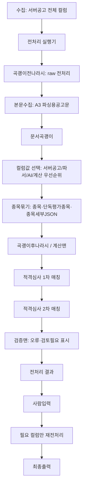

# 곡괭이질·곡괭이전나라시·문서곡괭이·계산맨·UIUX 통합 분석

작성일: 2026-05-26

## 목적

기존 `곡괭이질 버튼` 참고자료, 곡괭이전나라시 보완안, 계산맨 자료, UIUX 자료, 공고확인/특수실적 답변을 함께 보고
새 시스템에서 가져갈 구조와 버릴 결합을 정리한다.

이 문서는 통합 분석과 남은 질문을 함께 관리한다.
답변이 완료된 질문은 바로 아래에 반영 메모를 남긴다.

## 기존 곡괭이질 문서에서 가져갈 것

기존 구현의 파일명과 함수명은 그대로 쓰지 않는다.
하지만 아래 운영 원칙은 새 구조에도 필요하다.

| 가져갈 원칙 | 이유 | 예시 |
|---|---|---|
| 배치 대상 필터 | 사용자가 화면에서 좁힌 공고만 처리 가능해야 함 | 입력일=오늘, 종목=전기만 전처리 |
| 곡괭이전나라시 | 서버공고 raw만 보고 먼저 정리할 값이 있음 | 삭제키워드, 괄호정리, 적격발주처변경 |
| 삭제키워드 필터 | 전처리 전 제외 공고를 걸러야 함 | `scope=공사명`, `keyword=[취]`이면 취소건 제외 |
| 실패 row 보존 | 실패한 공고가 목록에서 사라지면 안 됨 | HTML fetch 실패 row도 전처리 화면에 오류로 표시 |
| 한 건씩 UI 갱신 | 수천 건 처리 중 진행상태를 볼 수 있어야 함 | 300건 중 120건 완료 표시 |
| source/evidence 기록 | 사람이 왜 값이 채워졌는지 봐야 함 | `matched_keyword=전자시담`, `source_text=...` |
| 미등록 발주처 모음 | 오류를 한 건씩 알리면 운영이 어려움 | 배치 끝에 미등록 발주처 5개 한번에 표시 |
| 메타 prefix 분류 | 원본 컬럼과 메타 컬럼을 분리해야 함. 단, 문서곡괭이 후보 컬럼을 별도로 늘리지 않는다 | `_api_*`, `_calc_*`, `_validation_*` |

## 기존 곡괭이질 문서에서 버릴 것

한 버튼 안에 너무 많은 책임을 넣는 구조는 새로 만들 때 분리한다.

| 버릴 결합 | 새 구조 | 예시 |
|---|---|---|
| Raw 화면 함수가 전체 파이프라인을 직접 제어 | 오케스트레이터가 단계 호출 | `전처리실행기`가 문서곡괭이/계산맨/적격매칭 호출 |
| mapAiToNotice에 특수 분기 집중 | 컬럼룰과 후처리 모듈로 분산 | 종목, 지역, 보험료를 각각 후처리기로 분리 |
| 문서곡괭이 결과와 계산 결과가 같은 patch에 섞임 | 출처별 후보와 최종값 분리 | parser candidate, calculation result, final value |
| UI alert 중심 | 작업 로그/검증 패널 중심 | native alert 대신 배치 결과 패널 |
| A3 기준 파싱 | 문서곡괭이는 A3 HTML만 사용 | A3가 정상 HTML이면 A2는 파싱 생략 |

## 새 전체 흐름 초안



주의:

```text
이 흐름은 단계 순서 초안이다.
실제 구현에서는 각 단계가 독립적으로 재실행 가능해야 한다.
```

예시:

```text
사람이 특수실적만 수정
  -> 문서곡괭이 전체 재실행 없음
  -> 적격심사 2차 매칭과 그 파생 계산만 재실행
```

## 설정 화면 구조 초안

UIUX 자료 기준으로 기존 화면 뼈대는 유지하되, 역할을 더 분명히 한다.

```text
룰관리
  - 컬럼 규칙
    - 표준 컬럼/처리방법/우선순위/참조방법/선택목록
  - 곡괭이전나라시
    - 삭제키워드
    - 괄호정리
    - 적격발주처변경
    - raw 형식 정리
  - 문서곡괭이
    - 룰 목록
    - 조건판단형태 가이드
    - 샘플 테스트
    - 실패/충돌 리포트
  - 확인/실적 키워드
    - 공고확인
    - 특수실적
    - 특수실적_공통
  - 적격심사기준
    - 제외 입찰방식
    - 발주처 정규화
    - 1차 기준표
    - 2차 세부조건
  - 지역설정
    - 행정지역
    - 배전사업소
    - 송전사업소
    - 폐광지역진흥지구
  - 종목설정
    - 종목매핑
    - 상호진출 상대종목
```

## 질문 답변 방법

아래 질문은 번호로 답하면 된다.

예시:

```text
Q-01: A
Q-02: 특수조건 원문은 남긴다. 예: ...
```

---

# 1. 특수조건 입력 라우터 질문

## Q-01. 사람이 `특수조건`에 여러 값을 입력하면 구분자는 `/`로 보면 될까?

예시:

```text
특수조건=기초금액발표전/사회적기업/무정전

공고확인 설정에 기초금액발표전 있음
특수실적_공통 설정에 사회적기업 있음
특수실적 설정에 무정전_준공금액 있음

결과:
공고확인=기초금액발표전
특수실적_공통=사회적기업
특수실적=무정전_준공금액
```

이렇게 처리할까?

## Q-02. 목적 컬럼으로 복사한 뒤 `특수조건` 원문은 남길까?

예시:

```text
입력 특수조건=사회적기업
복사 결과 특수실적_공통=사회적기업

특수조건도 `사회적기업`으로 유지할까?
아니면 이동 완료 후 빈값으로 둘까?
```

답변 반영:

```text
특수조건 원문은 남긴다.
계산맨/라우터가 필요한 값을 공고확인 같은 실제 참조 컬럼으로 복사한다.
```

## Q-03. `특수조건` 검색은 `검색키워드`만 볼까, `결과값`도 볼까?

예시:

```text
특수조건=기초금액발표전
공고확인 행:
결과값=기초금액발표전
검색키워드=기초금액 발표 전

입력값이 결과값과 정확히 같으면 검색키워드가 달라도 매칭할까?
```

## Q-04. 같은 입력값이 여러 탭에서 동시에 맞으면 어떻게 할까?

예시:

```text
특수조건=사회적기업
공고확인에도 결과값=사회적기업
특수실적_공통에도 결과값=사회적기업

둘 다 넣을까?
아니면 이동컬럼명 또는 탭 우선순위로 하나만 넣을까?
```

## Q-05. 결과값 중복 검증은 탭 안에서만 오류로 볼까?

예시:

```text
공고확인 결과값=특수실적
특수실적_공통 결과값=특수실적

같은 탭 안 중복은 오류지만,
서로 다른 탭 사이 중복은 경고만 할까?
```

---

# 2. 문서곡괭이 실행 질문

## Q-06. 문서곡괭이 본문 입력은 A3만 기본으로 둘까?

예시:

```text
A3 파싱용공고문이 정상 HTML로 들어옴.
A2 첨부파일 목록에도 입찰공고문.hwp가 있음.

이 경우 A2는 파싱하지 않고 A3만 볼까?
```

답변 반영:

```text
A3만 사용한다.
```

## Q-07. A3가 비거나 깨졌을 때만 A2를 예외 fallback으로 볼까?

예시:

```text
A3 응답이 빈 HTML 또는 오류.
A2 첨부파일에 입찰공고문.hwp 있음.

이때만 A2를 변환해서 파싱할까?
아니면 A2 fallback 자체도 새 구조에서는 빼고 사람 확인으로 둘까?
```

답변 반영:

```text
A2 fallback은 구현하지 않는다.
파싱은 A3 HTML만 사용한다.
```

## Q-08. 공고확인/특수실적/특수실적_공통은 7_1 같은 마스터 키워드 매처 하나로 볼까?

예시:

```text
대상컬럼=공고확인
참조마스터=공고확인
검색키워드가 있는 행만 순회
매칭되면 결과값 반환
```

이 구조면 될까?

## Q-09. `종목/발주처/대분류`는 문서곡괭이 후보 필터에 쓰지 않는 것으로 확인하면 될까?

예시:

```text
특수실적 행:
종목=전기
발주처=한국철도공사
대분류=철도신호
검색키워드=철도신호

row.종목=통신이어도 본문에 철도신호가 있으면 결과값을 반환한다.
이 원칙으로 고정하면 될까?
```

## Q-10. 제외키워드 범위는 같은 문장, 같은 문단, 매칭 전후 N자 중 무엇으로 할까?

예시:

```text
본문:
1문단: 상호진출 허용
10문단: 제출서류 허용하지 않음

제외키워드=허용하지 않음

10문단의 부정 표현 때문에 1문단의 상호진출을 제외하면 안 된다.
기본 범위를 같은 문단으로 둘까?
```

## Q-11. 문서곡괭이가 저장할 근거는 어느 수준까지 필요할까?

예시:

```text
값=전자시담
setting_tab=공고확인
rule_id=12
matched_keyword=전자시담
source_text=본 공고는 전자시담으로 진행합니다.
source_start=1234
source_end=1250
```

위 항목 중 위치값까지 필수로 저장할까?

답변 반영:

```text
상세모달에 rule_id, matched_keyword, source_text를 보여준다.
source_start/source_end 같은 위치값은 필수로 두지 않는다.
```

## Q-12. 문서곡괭이 실패도 기록할까?

예시:

```text
추정가격 키워드는 찾음.
하지만 뒤 30자 안에 금액이 없음.

실패 기록을 남겨 검증맨에서 보여줄까?
아니면 성공 후보만 저장할까?
```

---

# 3. 곡괭이전나라시·계산맨 질문

## Q-13. 곡괭이전나라시에 들어갈 기능 범위를 어디까지로 볼까?

예시:

```text
서버공고 raw만 보고 처리 가능한 기능:
- 공고명 삭제기준
- 괄호정리
- 적격발주처변경
- 투찰금액산식
- 날짜/숫자 형식 정리
```

답변 반영:

```text
현재 작업흐름에 적힌 범위를 우선 따른다.
추가 기능이 생기면 그때 논의한다.
```

## Q-14. 곡괭이후나라시는 문서곡괭이와 값 선택 이후에 실행하는 것으로 고정할까?

예시:

```text
서버공고 값 + 문서곡괭이 값
  -> 컬럼 우선순위로 최종 후보 선택
  -> 곡괭이후나라시 실행
  -> 적격심사 1차/2차 매칭
```

이 순서로 갈까?

## Q-15. 적격심사 2차 매핑 후 곡괭이후나라시를 한 번 더 돌려야 할까?

예시:

```text
2차 매핑에서 원발주처=한국전력공사(배전)으로 바뀜.
원발주처를 참조하는 계산 컬럼이 있음.

2차 매핑 후 곡괭이후나라시를 다시 돌려야 할까?
```

## Q-16. `적격업체=true`는 어떤 계산 컬럼을 채우나?

예시:

```text
특수실적_공통=사회적기업
해당 설정의 적격업체=true

계산맨이 `적격업체=1` 같은 컬럼을 채울까?
아니면 참여 가능 조건 검증에만 쓸까?
```

답변 반영:

```text
적격업체는 계산맨도 쓰지 않는다.
사용자 검색용 메타다.
```

## Q-17. 곡괭이후나라시의 빈값과 0은 엄격히 구분할까?

예시:

```text
순공사_투찰금액=0
  -> 대형공사 가드로 계산된 정상 0

특수실적_준공금액=빈값
  -> 사람이 채워야 하는 누락

계산맨에서 0과 빈값을 항상 구분해 저장할까?
```

## Q-18. 곡괭이전나라시와 곡괭이후나라시 결과도 근거를 남길까?

예시:

```text
곡괭이전나라시:
공고명 삭제기준 적용, rule_id=5

곡괭이후나라시:
예상투찰금액=979000000
근거:
투찰율_투찰금액=979000000
순공사_투찰금액=784000000
max 선택
```

이런 계산 근거를 셀 툴팁이나 상세 패널에 보여줄까?

---

# 4. 적격심사 2차 매핑 질문

## Q-19. 2차 매핑은 변경 row만 돌릴까, 선택된 row 전체를 다시 돌릴까?

예시:

```text
사람이 100건 중 1건의 공고확인만 수정.

방식 A: 그 1건만 2차 매핑
방식 B: 현재 화면의 100건 전체 2차 매핑

현재 전체 재실행도 문제 없었다고 했는데,
새 구조에서는 변경 row만으로 갈까?
```

## Q-20. 특수실적_공통은 2차 매핑표에서 어떤 조건 컬럼과 비교할까?

예시:

```text
row.특수실적_공통=사회적기업
2차 매핑표에는 조건 컬럼이 `특수실적`만 있음.

특수실적 조건에서 특수실적_공통도 같이 볼까?
아니면 2차 매핑표에 `특수실적_공통` 조건 컬럼을 새로 추가할까?
```

답변 반영:

```text
특수실적_공통은 2차 매핑표가 직접 참조하지 않는다.
특수조건 입력칸은 입력용이고, 계산맨/라우터가 그 값을 공고확인 같은 실제 참조 컬럼으로 옮긴다.
2차 매핑은 옮겨진 실제 참조 컬럼을 본다.
```

## Q-21. 공고확인은 정확히 전체값 일치, 특수실적은 포함검색으로 확정할까?

예시:

```text
공고확인:
row=배전공가/전자시담
조건=배전공가
  -> 불일치

특수실적:
row=무정전_준공금액/철도신호설비_준공금액
조건=무정전_준공금액
  -> 일치
```

이 차이를 그대로 고정할까?

---

# 5. UIUX 질문

## Q-22. 문서곡괭이 화면은 기존 iframe 구조를 버리고 앱 내부 화면으로 새로 만들까?

예시:

```text
기존 parser-test.html iframe:
룰 편집은 되지만 앱의 설정 UI와 디자인·상태 관리가 분리됨.

새 구조:
룰관리 > 문서곡괭이 화면 안에서 룰 목록, 테스트, 가이드를 같은 UI로 제공.
```

답변 반영:

```text
iframe 유지 여부보다 사람이 확인하기 아주 편한 UI가 최우선이다.
구현 방식은 검수 편의성 기준으로 정한다.
```

## Q-23. 특수조건 라우터는 사람입력 화면에서 즉시 실행할까?

예시:

```text
사람이 특수조건 셀에 `사회적기업` 입력.

방식 A: 입력 즉시 특수실적_공통 컬럼에 복사
방식 B: 저장 버튼 또는 2차분류 버튼 누를 때 복사
```

어느 쪽이 좋을까?

답변 반영:

```text
B. 저장 버튼 또는 2차분류 버튼 시점에 실행한다.
입력 즉시 라우팅하지 않는다.
```

## Q-24. 빨간 오류는 어느 화면에서 보여줄까?

예시:

```text
특수실적=공연장[3000M]_준공면적
준공면적 숫자가 없음.

사람입력 메인표 셀을 빨갛게 할까?
상세 모달 종목/특수실적 탭에서만 빨갛게 할까?
둘 다 할까?
```

답변 반영:

```text
특수실적 금액/면적/점수 누락 오류는 상세모달에서 빨갛게 표시한다.
```

## Q-25. `적격업체`는 특수실적_공통 설정 탭에서 체크박스로 직접 편집할까?

예시:

```text
결과값=사회적기업
적격업체=true

설정 화면 표에서 체크박스로 바로 바꿀 수 있게 할까?
```

답변 반영:

```text
적격업체는 사용자 검색용 메타다.
설정 탭에서는 검색/필터용으로만 다룬다.
```

## Q-26. Raw JSON 편집기는 관리자 전용으로 숨길까?

예시:

```text
일반 설정 화면:
표 형태로 행 추가/수정

고급 관리자:
원본 JSON 직접 편집
```

이렇게 나눌까?

---

# 6. 검증맨과 회귀 질문

## Q-27. 사람이 수정한 값을 정답 샘플로 등록할 수 있게 할까?

예시:

```text
문서곡괭이 결과 특수실적=빈값
사람이 특수실적=무정전_준공금액으로 수정

이 공고번호와 정답값을 저장해서 다음 룰 수정 때 회귀 테스트에 쓸까?
```

## Q-28. 배치 실패 row는 최종 엑셀에서 제외할까?

예시:

```text
공고문 fetch 실패로 문서곡괭이 미실행.
하지만 서버공고 원본 컬럼은 있음.

최종 엑셀에 포함하되 오류상태 컬럼을 남길까?
아니면 검토완료 전에는 출력 제외할까?
```

## Q-29. 메타 컬럼 prefix는 새로 정리할까?

예시:

```text
_api_입찰방식
_calc_예상투찰금액
_validation_상태
_preprocess_error

기존 `_f14_*`, `_ai_*`, `_v1_*`를 새 이름으로 정리할까?
문서곡괭이 후보값은 별도 `_parser_*` 컬럼을 만들지 않고 대상 컬럼에 덮어쓴다.
```

## Q-30. 삭제키워드 필터는 곡괭이전나라시에 두는 것으로 확정할까?

예시:

```text
삭제키워드 룰:
scope=공사명
keyword=[취]

공사명=[취] 도로포장공사
  -> 전처리 대상에서 제외
```

답변 반영:

```text
삭제키워드는 수집이 아니라 곡괭이전나라시 영역이다.
```

## Q-30-1. 곡괭이전나라시 룰 화면은 탭으로 나눌까?

예시:

```text
곡괭이전나라시
  - 삭제키워드
  - 괄호정리
  - 적격발주처변경
  - 투찰금액산식
```

답변 반영:

```text
탭으로 나눠야 관리가 편하다.
```

## Q-31. 진행 UI는 배치 작업 패널로 만들까?

예시:

```text
전처리 실행 중:
총 1000건
완료 320건
실패 3건
현재 공고번호 R26...
중단 버튼
실패 목록 다운로드
```

이 정도 진행 패널이 필요할까?

---

# 우선 답변이 필요한 질문

먼저 아래 항목만 답해도 다음 설계를 더 좁힐 수 있다.

```text
Q-10 제외키워드 문맥 범위
Q-15 2차 매핑 후 곡괭이후나라시 재실행 여부 또는 특수조건 라우터 실행 순서
Q-27 사람이 수정한 값을 정답 샘플로 등록할지
Q-28 배치 실패 row 최종 엑셀 포함 여부
Q-29 메타 컬럼 prefix 정리 여부
Q-31 진행 UI 배치 작업 패널 범위
```


